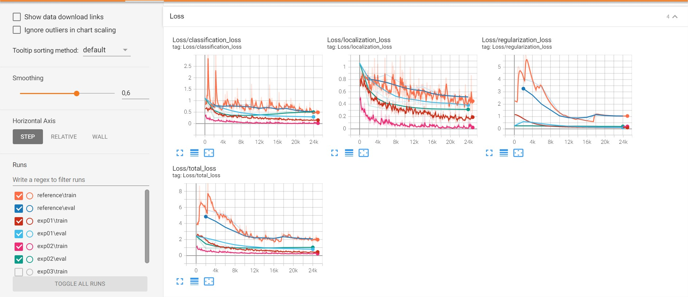

# Object Detection in an Urban Environment

### Project overview

This project is a part of the Udacity Self-Driving Car nano-degree, which consists of object detection in an urban environment. Detecting objects is one of the key tools enabling a self-driving car to understand its surrounding before taking the right action to drive safely to its designated destination. In this project, we train a deep learning model (#TODO: add name of model) on the Waymo Open dataset to have the ability to detect correctly cars, pedestrians, and cyclists in the car environment.

The original repository of this project can be found [here](https://github.com/udacity/nd013-c1-vision-starter)

### Set up

To set up locally this project, an NVIDIA GPU with the latest driver must be installed and docker/nvidia-docker. NVIDIA GeForce GTX 1660 Ti GPU was used to complete this project. For a complete guide on how to set up the project, a Dockerfile and requirements are available in the [build directory](./build).

Follow [the README therein](./build/README.md) to create a docker container and install all prerequisites.

#### Data

For this project, we will be using data from the [Waymo Open dataset](https://waymo.com/open/).

[OPTIONAL] - The files can be downloaded directly from the website as tar files or from the [Google Cloud Bucket](https://console.cloud.google.com/storage/browser/waymo_open_dataset_v_1_2_0_individual_files/) as individual tf records.

### Download and process the data

The first goal of this project is to download the data from the Waymo's Google Cloud bucket to your local machine. For this project, we only need a subset of the data provided (for example, we do not need to use the Lidar data). Therefore, we are going to download and trim immediately each file. In `download_process.py`, you can view the `create_tf_example` function, which will perform this processing. This function takes the components of a Waymo Tf record and saves them in the Tf Object Detection api format. An example of such function is described [here](https://tensorflow-object-detection-api-tutorial.readthedocs.io/en/latest/training.html#create-tensorflow-records). We are already providing the `label_map.pbtxt` file.

You can run the script using the following command:
```
python download_process.py --data_dir {processed_file_location} --size {number of files you want to download}
```

### Dataset

#### Dataset analysis

The Waymo Open dataset consisting of tf-records containing images with different weather and driving conditions (sunny/rainy/foggy, day/night) as well as labels indicating the presence of cars (red bounding boxes), cyclists (green bounding boxes) and pedestrians (blue bounding boxes):


<picture>
  
</picture>

<p align="center">
Different weather driving condition (day, night, rainy, foggy) and different classes (car, cyclist, pedestrian)
</p>

To have a better idea about the distributions of the labels in our dataset, we sample 500000 images randomly, and we plot the number of labels found per class ("car", "cyclist", "padasterian").

The table below summarizes the percentage of each class present taken from 500000 images:

| class      | car    | cyclist | padasterian |
| :---:      | :---:  | :---:   | :---:       |
| #labels   | 817748 | 230927  | 5680        |
| percentage | 77.56 %| 21.9 %  | 0.54 %      |

The distribution of the classes in 500000 images:

</picture>
  
</picture>

<p align="center">
Classes distribution taken from 500000 images
</p>

The dataset is very unbalanced with the class car being in the majority, which can affect the accuracy of the detector. However, this problem can be mitigated by using data augmentation.

#### Cross validation
In this project, we use 100 tfrecord files for training, validation, and testing. 80% of the tfrecord files are used for training, 10% for validation to check if the model is overfitting (e.g., validation loss starts to increase), and the remaining 10% for testing to evaluate the performance of the model after the end of the training process and to see if the model generalizes well on unseen data.

### Training
#### Reference experiment
In the section, we use a SSD Resnet 50 640x640 model, which a single shot detector, that is faster than the previous state-of-the-art for single shot detectors (YOLO), and significantly more accurate, in fact as accurate as slower techniques that perform explicit regionproposals and pooling (including Faster R-CNN). [1]
This model is trained using a batch size of 2, all other details are indicated in the reference [config file](./experiments/reference/pipeline_reference.config).

The learning and validation curves for the reference experiment show that the training/validation losses are still high (around 0.5 as total training loss at the end of the training), which indicates that they hyperparameters choice was not appropriate, as shown in the following figure:

</picture>
  
</picture>

<p align="center">
Training and validation losses of the reference experiment
</p>

In addition, the recall and precision curves shows that the model performed poorly on the validation data as shown in the following figure:

Precision curves:

</picture>
  
</picture>

<p align="center">
Precision curves of the reference experiment
</p>

Recall curves:

</picture>
  
</picture>

<p align="center">
Recall curves of the reference experiment
</p>

#### Improve on the reference

#### First expirement

To improve the reference experiment, we start by increasing the batch size from 2 to 4, increasing the batch size comes with the benefits of a less noisy gradient, which helps find a better optimization direction while optimizing the model the corresponding config file can be found [here](./experiments/exp01/pipeline_exp01.config).

The following figure shows the training and validation losses of the first experiment relatively to the reference one:

</picture>
  
</picture>

<p align="center">
Training and validation losses of the first expirement in comparison to the reference one.
</p>

Increasing the batch size has a major impact on improving the training process, since it provides a better gradient estimate during the optimization of the model parameters. However this comes with price of a higher computational consumption.

Precision curves:

</picture>
  
</picture>

<p align="center">
Precision curves of the first experiment in comparison to the reference one
</p>

Recall curves:

</picture>
  
</picture>

<p align="center">
Precision curves of the first experiment in comparison to the reference one
</p>

The precision and recall curves of the first experiment have improved significantly due to the increase in the batch size.

#### Second expirement
Another hyperparameter that plays a curcial in the training phase is the learning rate, a high learning rate will result in overshooting/divergence while optimizing the model. In this experiment, we decrease the learning rate from to bla bla.

The following figure shows the training and validation losses of the second experiment relatively to the first and reference ones:

</picture>
  
</picture>

<p align="center">
Training and validation losses of the second experiment in comparison to the first and reference ones
</p>

Increasing the batch size has a major impact on improving the training process, since it provides a better gradient estimate during the optimization of the model parameters. However this comes with price of a higher computational consumption.

Precision curves:

</picture>
  
</picture>

<p align="center">
Precision curves of the second experiment in comparison to the first and reference ones
</p>

Recall curves:

</picture>
  
</picture>

<p align="center">
Precision curves of the second experiment in comparison to the first and reference ones.
</p>


#### Add data augmentation
As discussed in the data analysis chapter, the data is highly unbalanced, which might induce a bias during inference time since the model has seen the majority class (class "car") more than the other classes ("cyclist" and "pedestrian"). One way to mitigate the bias is to use data augmentation.
Some examples of used data augmentation technics to improve the performance of the model are:

- Random rotation by 90 degrees with a probability of 0.3:

</picture>
  
</picture>

<p align="center">
Random rotation by 90 degrees
</p>

- Random RGB to gray with a probability of 0.4:

</picture>
  
</picture>

<p align="center">
RGB to grayscale transforamtion
</p>

- Random horizontal and vertical flips with a probability of 0.3:

</picture>
  
</picture>

<p align="center">
Horizontal flip
</p>

</picture>
  
</picture>

<p align="center">
Vertical flip
</p>

- Random gaussian patches with a probablity of 0.2:

</picture>
  
</picture>

<p align="center">
Random gaussian patches
</p>

The following figure shows the training and validation losses of the third experiment (with data augmentation) relatively to the previous experiments:

</picture>
  
</picture>

<p align="center">
Training and validation losses of the third experiment in comparison to the previous ones
</p>

Increasing the batch size has a major impact on improving the training process, since it provides a better gradient estimate during the optimization of the model parameters. However this comes with price of a higher computational consumption.

Precision curves:

</picture>
  
</picture>

<p align="center">
Precision curves of the third experiment in comparison to the previous ones
</p>

Recall curves:

</picture>
  
</picture>

<p align="center">
Precision curves of the third experiment in comparison to the previous ones
</p>