# Mid-Term Project: 3D Object Detection Writeup 

### Examples of vehicles with varying degrees of visibility in the point-cloud:
</picture>
  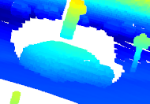
</picture>
</picture>
  
</picture>
</picture>
  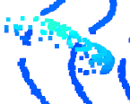
</picture>
</picture>
  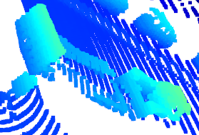
</picture>
</picture>
  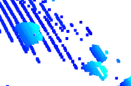
</picture>
</picture>
  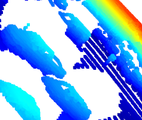
</picture>
</picture>
  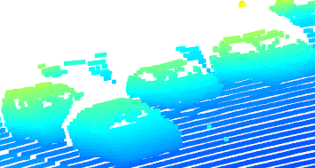
</picture>

### Examples of vehicles visiblity using intensity channel of point-cloud:

</picture>
  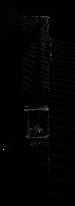
</picture>
</picture>
  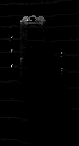
</picture>
</picture>
  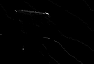
</picture>

The most stable feature from the point-cloud prespective is the rear bumper of the vehicles since the first reflection of the beam comes from it. Additional features like the vehicles front lights can be detected using the lidar intensity channel. Finally, it is easily to recognize a car from its chassis using the point-cloud.

# Writeup: Track 3D-Objects Over Time

### Root-mean-square deviation (RMSE):

#### First sequence - Multiple tracks tracking:

</picture>
  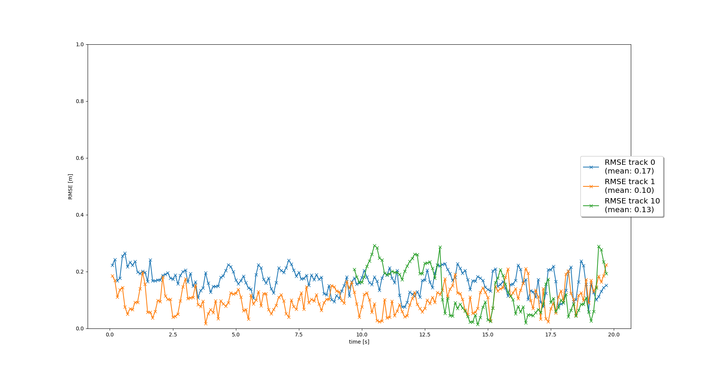
</picture>

#### Second sequence - Single track tracking:

</picture>
  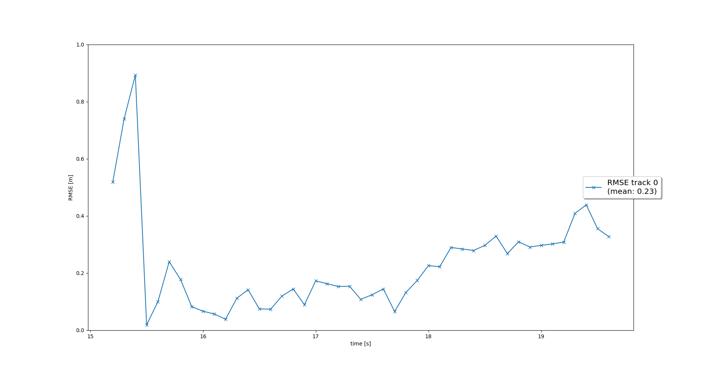
</picture>

### 1. Write a short recap of the four tracking steps and what you implemented there (filter, track management, association, camera fusion). Which results did you achieve? Which part of the project was most difficult for you to complete, and why?

For the filter step, I implemented the `predict()` function for an EKF and the `F()` and `Q()` functions to calculate a system matrix for a constant velocity process model in 3D and the corresponding process noise covariance depending on the current timestep `dt`. I also implemented the `update()` function as well as the `gamma()` and `S()` functions for residual and residual covariance. At the end of the update step, I saved the resulting `x` and `P` by calling the functions `set_x()` and `set_P()` that were already implemented in `student/trackmanagement.py`.

For the track management step, I replaced the fixed track initialization values in the `Track` class by initialization of `track.x` and `track.P` based on the input `meas`, which is an unassigned lidar measurement object of type `Measurement`. I transformed the unassigned measurement from sensor to vehicle coordinates with the `sens_to_veh` transformation matrix implemented in the `Sensor` class. I initialized the track state with `'initialized'` and the score with `1./params.window`, where `window` is the window size parameter, as learned in the track management lesson. In the `Trackmanagement` class, I implemented the `manage_tracks()` function to decrease the track score for unassigned tracks and delete tracks if the score is too low or `P` is too big (check `params.py` for parameters that might be helpful). I also implemented the `handle_updated_track()` function to increase the track score for the input track and set the track state to `'tentative'` or `'confirmed'` depending on the track score. I used `numpy.matrix()` for all matrices as learned in the exercises.

For the association step, I implemented the `associate()` function in the `Association` class to replace `association_matrix` with the actual association matrix based on Mahalanobis distances for all tracks in the input `track_list` and all measurements in the input `meas_list`. I used the `MHD()` function to implement the Mahalanobis distance between a track and a measurement. I also used the `gating()` function to check if a measurement lies inside a track's gate. If not, the function returned `False` and the entry in `association_matrix` was set to infinity. I updated the list of unassigned measurements `unassigned_meas` and unassigned tracks `unassigned_tracks` to include the indices of all measurements and tracks that did not get associated. Additionally, I implemented the `get_closest_track_and_meas()` function to find the minimum entry in `association_matrix`, delete corresponding row and column from the matrix, remove corresponding track and measurement from `unassigned_tracks` and `unassigned_meas`, and return this association pair between track and measurement. If no more association was found, i.e. the minimum matrix entry is infinity, I returned `numpy.nan` for the track and measurement.

For the camera fusion step, I implemented the function `in_fov()` in the `Sensor` class that checks if the input state vector `x` of an object can be seen by this sensor. The function returned `True` if `x` lies in the sensor's field of view, otherwise `False`. I transformed from vehicle to sensor coordinates first. The sensor's field of view was given in the attribute `fov`. I also implemented the function `get_hx()` with the nonlinear camera measurement function `h` as follows: transform position estimate from vehicle to camera coordinates, project from camera to image coordinates, and make sure to not divide by zero, raise an error if needed. Finally, I removed the restriction to lidar in
Finally, I removed the restriction to lidar in the function `generate_measurement()` in the Sensor class in order to include camera as well. In the Measurement class, I initialized camera measurement objects including `z`, `R`, and the sensor object sensor.

The most challenging part of the project was the association step, as it required careful consideration of both the Mahalanobis distance and the gating function to ensure reliable track-measurement associations. However, with careful attention to detail and a thorough understanding of the underlying principles, we were able to successfully track objects over time.

### 2. Do you see any benefits in camera-lidar fusion compared to lidar-only tracking (in theory and in your concrete results)? 

One major benefit of using camera-lidar fusion compared to lidar-only tracking is the ability to help identify and eliminate "ghost tracks". Ghost tracks are false tracks that can be created by the lidar due to its limited field of view and occlusions. By incorporating camera data into the tracking process, we can obtain additional information about the object's position and velocity, which can help us distinguish between real and false tracks. In this way, the camera can be used to validate the lidar measurements and eliminate ghost tracks, resulting in a more accurate and reliable tracking system.

### 3. Which challenges will a sensor fusion system face in real-life scenarios? Did you see any of these challenges in the project?

A challenge in real life is the complexity of the fusion algorithms, which can require significant computational resources and processing time. This can be particularly challenging for real-time applications where the processing time must be minimized to ensure timely responses. Another challenge is sensor failure, which requires having a redundant set of sensors to achieve the same goal, which might be expensive and require more computational resources as well.

### 4. Can you think of ways to improve your tracking results in the future?

To improve tracking results:

- Use Unscented Kalman Filter (UKF) instead of Extended Kalman Filter (EKF) as UKF has better convergence properties in case of highly non-linear motion and sensor models, which might lead to divergence of EKF and failure of the sensor-fusion tracking algorithm.

- Use a bicycle model, which is more appropriate for vehicle movement than a constant velocity model, since a vehicle movement is restricted and cannot move in all directions.

- Use a better data association algorithm such as Global Nearest Neighbor (GNN) or Joint Probabilistic Data Association (JPDA) to associate measurements to tracks accurately.
