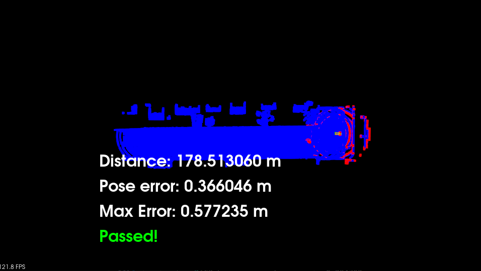

# Scan Matching Localization - Project Overview

In this project, the goal is to localize a car while driving in simulation for at least 170m from the starting position, ensuring that the distance pose error does not exceed 1.2m. The simulation car is equipped with a lidar, which provides lidar scans at regular intervals. Additionally, a point cloud map named `map.pcd` is available, and car localization can be achieved by employing point registration matching between the map and the lidar scans. The point cloud map has been extracted from the CARLA simulator.

## Dependencies

### Carla Simulator
Follow the steps to install the CARLA simulator: [CARLA Quickstart Guide](https://carla.readthedocs.io/en/latest/start_quickstart).

### PCL Library
Follow the steps to install the PCL Library: [PCL Library Installation](https://github.com/PointCloudLibrary/pcl).

## Usage

1. Start the CARLA simulator by running:
```
./run_carla.sh
```

2. Open another terminal, and compile the project using these Unix commands:
```
cmake .
make
```

3. Run the project with the NDT algorithm using the Unix command:
```
./cloud_loc
```

Alternatively, run the project with the ICP algorithm using the Unix command:
```
./cloud_loc 2
```

4. During runtime, click on the map and tap the UP key three times, with one-second delays between taps. If the green car falls behind, re-run the project and repeat the tapping process. Subsequent runs typically yield better results than the first run.

## Results

### Iterative Closest Point (ICP) Algorithm


### Normal Distributions Transform (NDT) Algorithm



## Conclusions

- The NDT algorithm provides a more accurate localization result with a maximum error of 0.57 m, outperforming the ICP algorithm, which has a maximum error of 1.10 m.
- Both algorithms demonstrate efficient convergence, requiring only a few iterations to reach their respective solutions (a maximum of 5 iterations).
